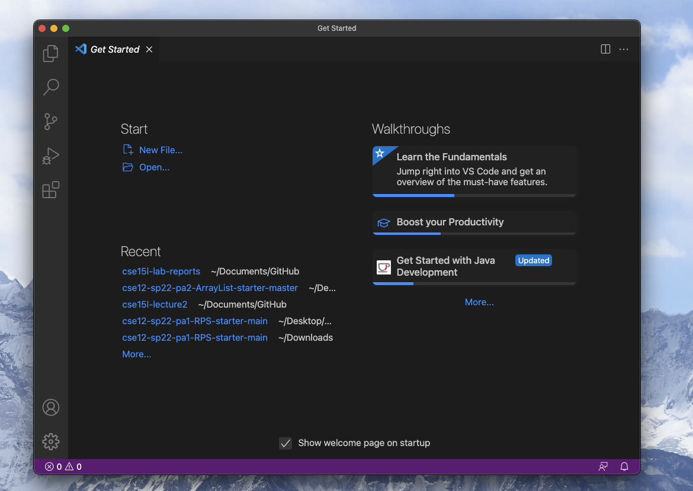
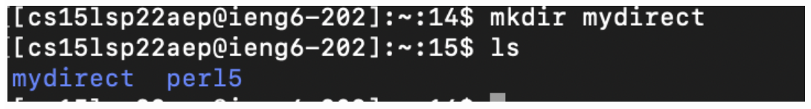
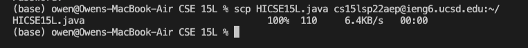
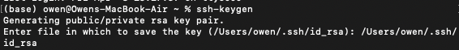
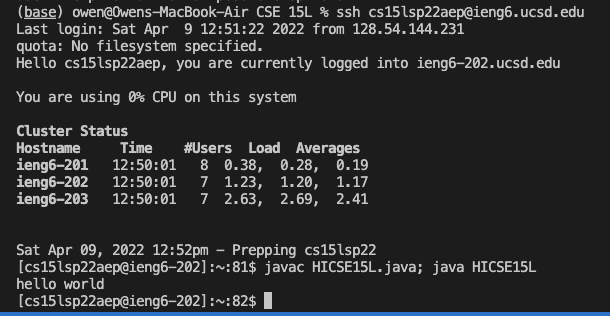
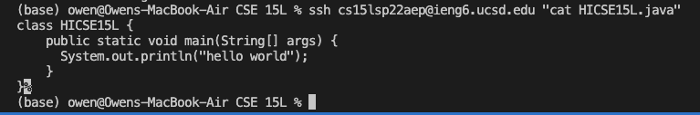

# Week 2 Lab Report
## Guide to Remote Access

### Installing VSCode
> To install VSCode on your local computer follow this [link](https://code.visualstudio.com/) and install the version that corresponds to its operating system. Press "Accept" on the prompts that appear until VScode opens on your desktop. It should look something like this:

### Remotely Connecting
> With VSCode installed, we now have a convenient way of viewing and modifying files as well as acessing the **Terminal** where we can run UNIX commands and connect to a remote computer. To do the latter, we first need to look up our course specific account by visiing the following [link](https://sdacs.ucsd.edu/~icc/index.php) and entering the appropriate login credentials. This is mine `cs15lsp22aep`. Next navigate over to VSCode and find the **Terminal** button at the top. Hover over it and click "New Terminal". In the box that appears type `ssh` followed by a space, your course specific account name, and `@ieng6.ucsd.edu`. It should look ike this: `ssh cs15lsp22aep@ieng6.ucsd.edu`. Press enter and provide your password, and you should see something like this:

---
### Trying Some Commands
> Completion of the above steps means that you are now remotely connected to a another computer. Unfortunately, there is no GUI to help us navigate its files and directories. To navigate through this computer therefore, we need to make use of UNIX commands. I have listed some of the most essential ones below:

```
pwd                             prints the working directory (which one you are in currently)
cd                              change directory (specify which sub directory in the parent directory you want to change the working directory to)
cd ~                            takes you back to the home directory
cd ..                           takes you back to the parent directory
ls                              lists all sub directories in the current directory (useful to know what you can cd to)
cp "source" " destination"      copies the contents from the source file onto the destination file  (overrides whatever was previously in it). 
                                If the destination file doesn't exist, a new file with its nakme is created and the contents are copied over to it
cat "filename"                  prints out the contents of the provided file
mkdir "name"                    makes a new directory in the working directory with the provided name
```
> You can enter these commands into the terminal to see how they work. For example, here is me making a new directory in the working directory using `mkdir`, then using `ls` to see that it has indeed been created

---
### Moving Files with `scp`
> The scp command is one that is used to move files between two different computers. To use it, follow the format specified below. Keep in mind that you need to specify the directories of where the file is located (if it is in a different working directory) and needs to be sent as well.
```
scp "target file" "target destination"
```
> For example, this is me sending a .java file from my working directory on my local computer to the home directory of the remote computer.

---
### Setting an SSH Key
> So far, whenever we've tried connecting to the remote computer, it was always asked us for our password, which makes the process rather inconvenient for us. To get around this, we can set up an SSH key pair to automatically authenticate ourselves instead.

>To do so, use and run the command `ssh-keygen` in the terminal of your local machine and follow the prompts. It should ask you where you want to save the key, in which case just copy the file directory path in the parenthesis an press enter. You should see something like this at this step.   


> Keep pressing enter at this point until the key pair is generated. At which point, you will have generated and stored a public and a private key in the .ssh directory. Next we need to send the public key (stored locally in .ssh/id_rsa.pub) to the .ssh directory on the remote computer. To do this we need to first make an .ssh directory then utilize the scp command. On the remote computer enter `mkdir .ssh`. Then on the local computer, use scp to tranfer the id_rsa.pub file to the remote computer. For me, the command looks like this:
```
scp /Users/owen/.ssh/id_rsa.pub cs15lsp22aep@ieng6.ucsd.edu:~/.ssh/authorized_keys
```
---
### Optimizing Remote Running
> It is possible to enter more than one command per line, essentially allowing multiple commands to run in one line. To do this, you can separate commands using semicolons. For example, this is how you would compile and run the `HICSE15L.java` file stored on the home directory of the remote computer in one line: 



> Similarly can also use a single command encased in "" to run it after an ssh command. For example:



 


