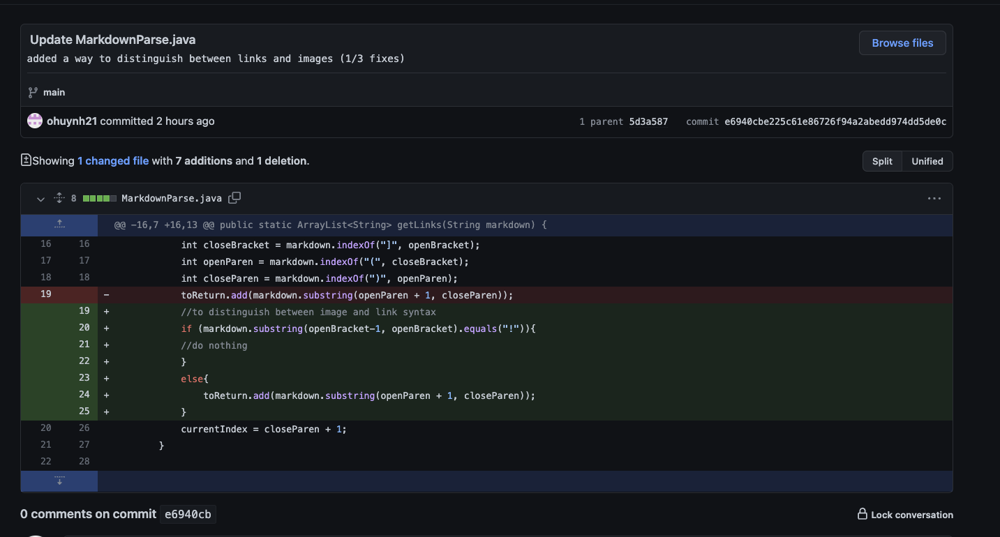
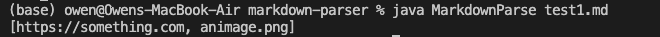
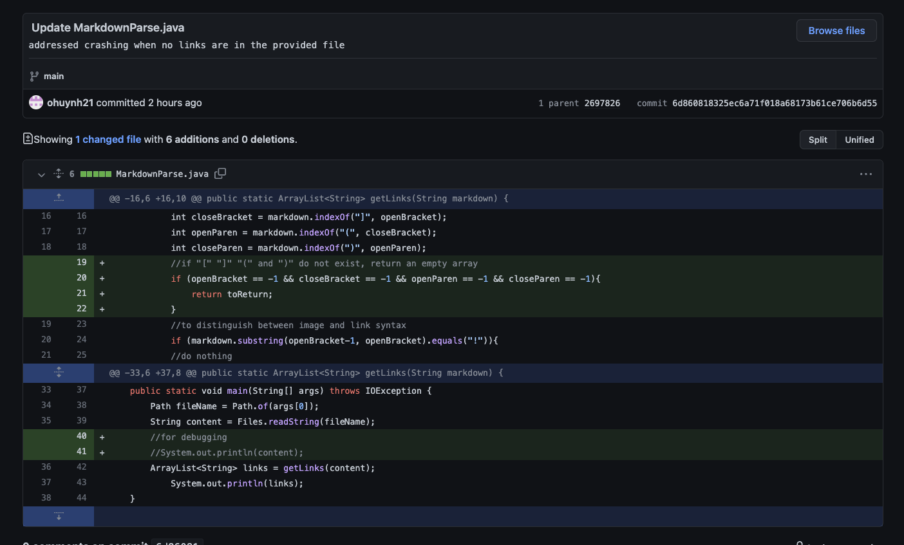
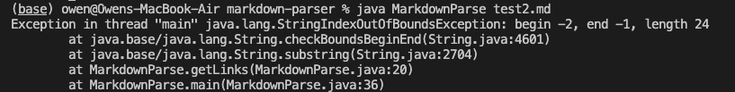
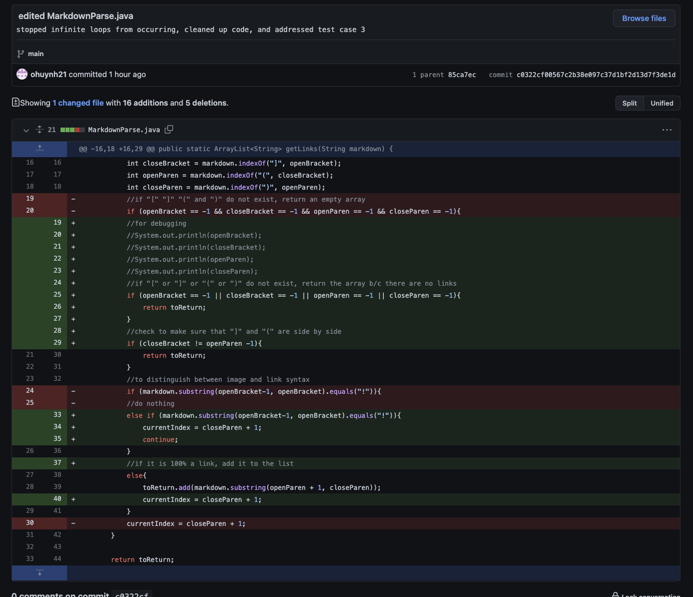

# Week 4 Lab Report
## Debugging

#### Change #1

[Link to the test file](https://github.com/ohuynh21/markdown-parser/blob/main/test1.md?plain=1)

Output before fix was implemented:

Relationship:

Markdownparse did not have the ability to differentiate between the syntax for links and images in the Markdown language since it did not check for the presence of "!" before openBacket. Because the syntax for embedding an image `` and embedding a hyperlink `[Link](url)` is very similar, when an input (test1.md) includes code for embedding an image, Markdownparse treats the image path as if it were a url for a hyperlink. In other words, because Markdownparse could not differentiate between `` and `[Link](url)`, the output includes `animage.png` even though it's not a url.

#### Change #2

[Link to the test file](https://github.com/ohuynh21/markdown-parser/blob/main/test2.md?plain=1)

Output before fix was implemented:

Relationship:

A file with no links caused Markdownparse to output a StringIndexOutOfBounds exception because it gave the `substring()` method (implemented in change 1) invalid arguments. Because `"[", "]", "(", and ")"` were not present in test2.md, the `indexOf()` methods used in the original implementation returned `-1` for each, which was subsequently used in the `substring()` method on line 24. Because the `substring()` method does not accept negative indexes (integers) as arguments, it throws the above error, which crashes the code.
#### Change #3

[Link to the test file](https://github.com/ohuynh21/markdown-parser/blob/main/test3.md?plain=1)

Relationship:
While the fix implemented in change 2 was enough to address files with no links, it failed to accomodate files with only (). This had to do with the use of `&&` when checking if `[", "]", "(", and ")"` were missing. This meant that when the test file had only (), the if statement would evaluate to false and not terminate the loop to prevent negative indexes from being passed into string methods. Like in change 2, this was a problem because the `indexOf()` method returned -1 for the values of openBracket and closeBracket (since they were not in the file), which were then passed into the substring() method. As was the case before, this caused the method to throw a StringIndexOutOfBounds exception, crashing the program.