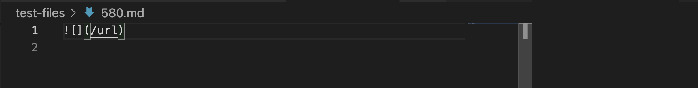

# Week 10 Lab Report
## Comparing Implementations

### Test #1
Link to test file: [#201](https://github.com/nidhidhamnani/markdown-parser/blob/main/test-files/201.md?plain=1)

How I found this test?
> After running the bash for loop provided in the file `script.sh` and redirecting the results to a file named results.txt on both implementations, I ran the following command to view the differences between the outputs:
 `vimdiff my-markdown-parser/results.txt cse15lsp22-markdown-parser/results.txt`
 Towards the top of the vimdiff interface, the outputs for this test file were the one of the first to be highlighted.
 This difference can be seen below:

My implementation's output:

Provided implementation's output:

The expected output:

Based on VSCode's preview, it appears that the expected output should be `[]`. This makes the output of the provided implementation incorrect. It seems the reason for this is because the getLinks method in the provided implementation just takes whatever's in between the `()` without caring where the last `]` is located. This effectively means that when there's a space or extra characters in between the `]` and the `(`, getlinks will take whatever's inside the `()` even though Markdown requires that the `(` be immediately after the `]`. 

To resolve this bug, we can add a conditional statement to check if the `(` is exactly one index after the `]`. If this is the case, proceed with adding the link as usual. Otherwise, the link within the `()` is invalid, and we should skip to finding the next open bracket in the file. We can add the conditional right after we compute the index of the open parenthesis, so somewhere here:

### Test #2
Link to test file: [#580](https://github.com/nidhidhamnani/markdown-parser/blob/main/test-files/580.md?plain=1)

How I found this test?
> This test was found in a very similar fashion to test 1 (#201). I basically script in `script.sh` and made the results output to a file named results.txt. I then used the same vimdiff command referenced earlier. This time, instead of scolling up on the vimdiff interface, I scrolled down to the very bottom and saw the following conflicting outputs:

My implementation's output:

Provided implementation's output:

The expected output:

Based on VSCode's preview the expected output should be `[]`. This makes the output of the provided implementation incorrect. The reason for this is because the code in getLinks never checks for the existence of `!` in front of each `[` and therefore cannot distinguish between images and link syntax. The reason why doing so is important is because MarkdownParse is intended to grab and return all urls successfully used as hyperlinks for the text specified in the `[]`. Thus, the links or file path present in between the `()` for an image `` should not be included since what's displayed isn't a clickable link that looks like this [click](), but rather a picture (that doesn't redirect the user anywhere).

To resolve this, we can check for the existence of an `!` before we check for `[`. Alternatively we could also check that `!` comes immediately before `[` once we find the index of `[`. To proceed with the latter, we can again add a conditional statement to check that at the index of openBracket, `markdown.substring(openBracket - 1)` is not `!`. If there is one, skip to the next `[`, if not proceed as normal. We might also need to add another conditional to prevent an index out of bounds error if openBracket is at index 0. We should add this immediately after we find the first `[`. In the provided implementation, adding these if statements right after the highlighted location is a good spot:

